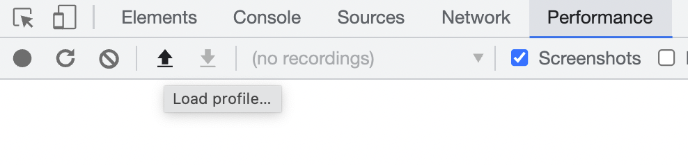

# ⚔️ wpt-gauntlet

wpt-gauntlet is a tool for running a page through a "gauntlet" of web page test runs. This can be combined with `jq` or `tracex` to do custom lab performance benchmarking at a scale large enough for statistical significance:

```
$ npx wpt-gauntlet --url "https://example.com" --resultType profile --runs 100

[⚔️ wpt-gauntlet] Tests started. test ids: 220420_AiDc0W_4XY,...
[⚔️ wpt-gauntlet] Waiting 2 minutes for tests to be completed
[⚔️ wpt-gauntlet] All tests completed.
[⚔️ wpt-gauntlet] Profiles written to files in ./output

$ ls ./output
profile-0.json
profile-1.json
...
profile-99.json
```

You might need wpt-gauntlet if:

- The metrics you need to calculate are custom, or not easily available in other lab testing tools
- You need statistical significance for benchmarking (eg. profiling two versions of the same page may require a large number of trials)

## Usage

To get started, you can install `wpt-gauntlet` locally, or run it using npx:

```sh
$ npx wpt-gauntlet --help
```

You will also need a web page test API key. This can be obtained from the [webpagetest site](https://product.webpagetest.org/api). Once you have this key, you can set it with an environment variable:

```sh
export WPT_APIKEY=1a2b3-1234-...
```

Note: you will need to set this environment variable for each session you use wpt-gauntlet for

### Options

See the most up-to-date documentation using the `--help` argument to wpt-gauntlet

```sh
  --url              The url to test                    [string] [default: null]
  --output           The output profile name prefix. Will be suffixed with the c
                     ount, eg. ${output}-1.json       [string] [default: "test"]
  --outputDirectory  The output directory for profiles
                                                    [string] [default: "output"]
  --runs             The number of runs to perform         [number] [default: 1]
  --timeout          Max number of minutes to wait for test result
                                                           [number] [default: 2]
  --pool             The max pool size, for parallel requests
                                                          [number] [default: 10]
  --batchSize        The max number of tests to allow running at once
                                                          [number] [default: 20]
  --batchDelay       The amount of time to allow between tests
                                                           [number] [default: 0]
  --resultType       Comma separated list of data to collect. Options include pr
                     ofile,summary                 [string] [default: "profile"]
  --testIds          Comma separated list of test ids to fetch. If provided, ski
                     ps running the tests and just fetches results
                                                        [string] [default: null]
```

## Result types

The two result types that wpt-gauntlet can collect are:

**Profile**: a full trace, collected during runtime. This can be loaded into chrome devtools for individual inspection:



To aggregate results from the trace, these profiles can be analyzed using tracex. See the usage examples section for more details.

**Summary**: a summary of metrics collected from webpagetest itself. The summary json blob contains many metrics, and is best inspected manually to see which metrics are available. See usage examples for more details on how these summaries can be used.

## Usage examples

### Summary analysis using jq

With summary output, we can extract specific metrics from the individual web page test runs using [jq](https://stedolan.github.io/jq/). For example, running

```sh
$ npx wpt-gauntlet --url "https://example.com" --resultType summary --runs 100
```

Gives us 100 json files in `./output` that we can then run jq over:

```sh
$ cat output/react-*.json | jq ".TotalBlockingTime"

1000
1152
982
234
1100
...
```

Further statistical analysis can be done on these results. See the summary json files for more information on possible metrics to query for from the individual summaries.

### Trace analysis using tracex

tracex is a tool that extracts trace metrics from individual profiles. This can be used to extract traces from profiles. For example,

```sh
$ npx wpt-gauntlet --url "https://example.com" --resultType profile --runs 100
```

Gives us 100 json files in `./output` that we can then run `tracex` over:

```sh
$ npx tracex extract "../output/profile-*" --functions "foo"
...
[📊 tracex] --- Results ---
fileName,function.foo:timeTotal,function.foo:samplesPresent,function.foo:sampleTotal
../wpt-gauntlet/output/react-profile-0.json,17296,51,70954
../wpt-gauntlet/output/react-profile-1.json,17296,51,70954
```

Giving us insight into how often a particular function is present in the trace, and how much time is spent inside that function.

### Resuming tests

There are some instances when you might wish to collect results from already run tests. These may be tests run outside of wpt-gauntlet, or tests run with wpt-gauntlet that need to be resumed.

To achieve this, you can pass a comma separated list of `testIds` to wpt-gauntlet:

```sh
$ npx wpt-gauntlet --testIds 123abc,456def,...
```

Test ids are output when wpt-gauntlet runs – if you wish to resume or re-collect results from webpagetest later, you should save these as a reference.
